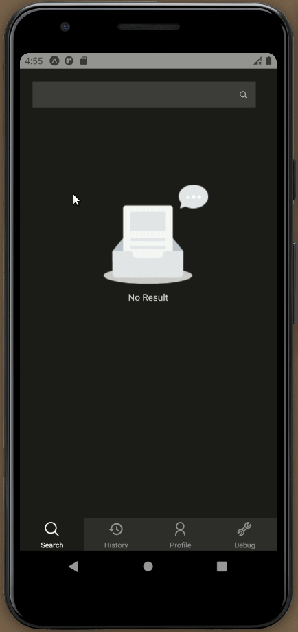

# noob dict mobile
> 中英词典移动客户端 (react native)

### 为什么做这个？
1. 同步自己在所有设备上的查词记录与笔记，方便自己记单词。
2. 现在的查词 App 不太符合我的查词习惯，且常有烦人的开屏广告。

### 如何安装？
在 [builds](https://expo.io/dashboard/noob9527/noob-dict-mobile/builds) 页面下载最新的适合你当前操作系统的版本，下载安装。

### 相关仓库
- [noob dict desktop](https://github.com/noob9527/noob-dict-desktop) 是基于 electron 的桌面客户端，由于我只用 ubuntu 系统，目前只在 ubuntu 系统上测试过。
- [noob dict mobile](https://github.com/noob9527/noob-dict-mobile) 是基于 react native 的移动客户端，由于我只有 android 手机，目前只有 android build。

